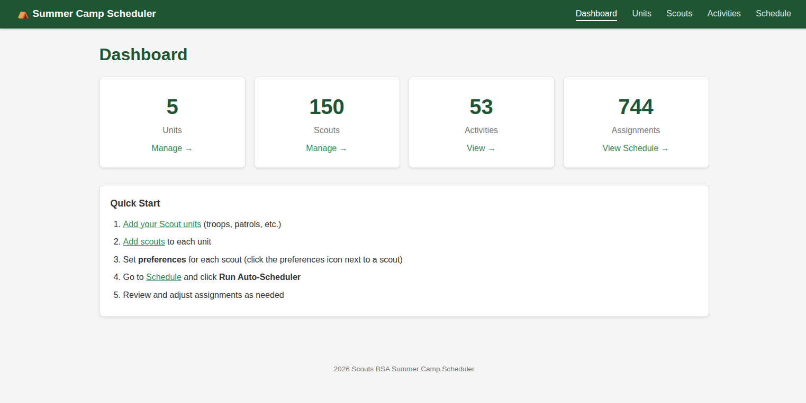
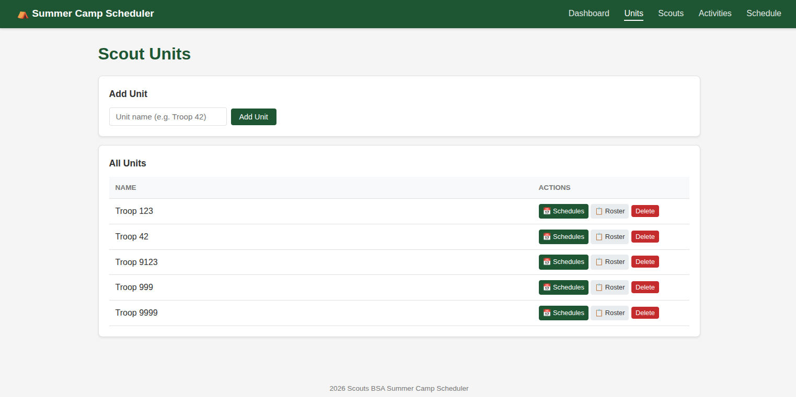
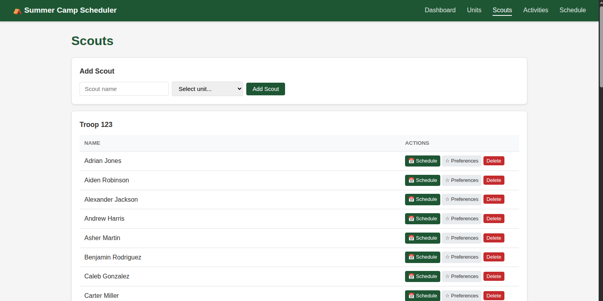
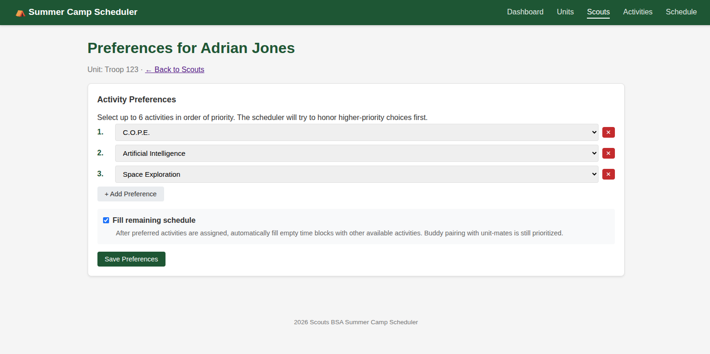
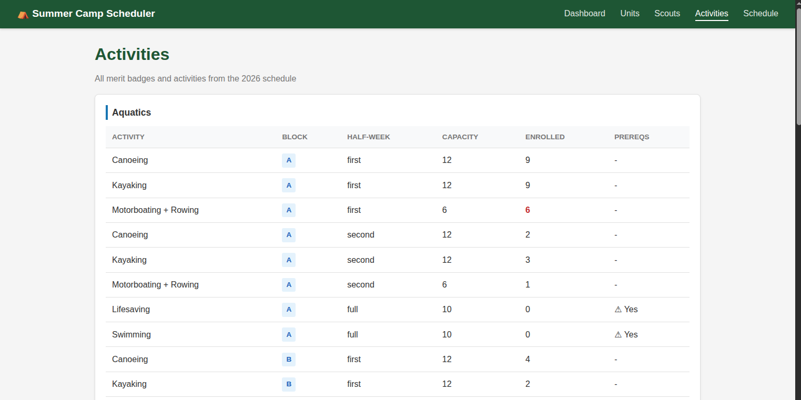
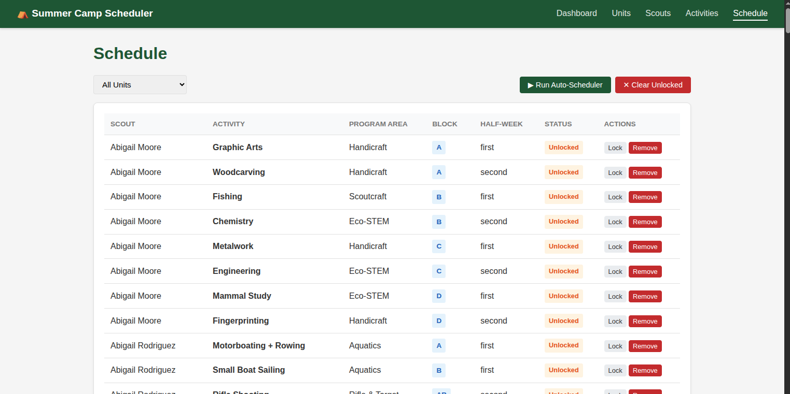
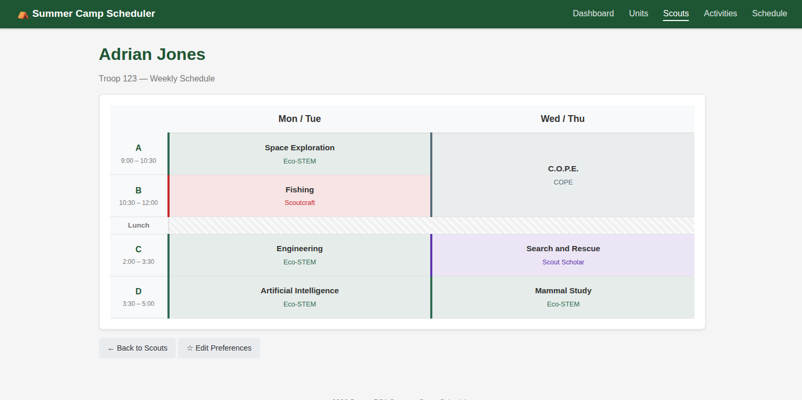
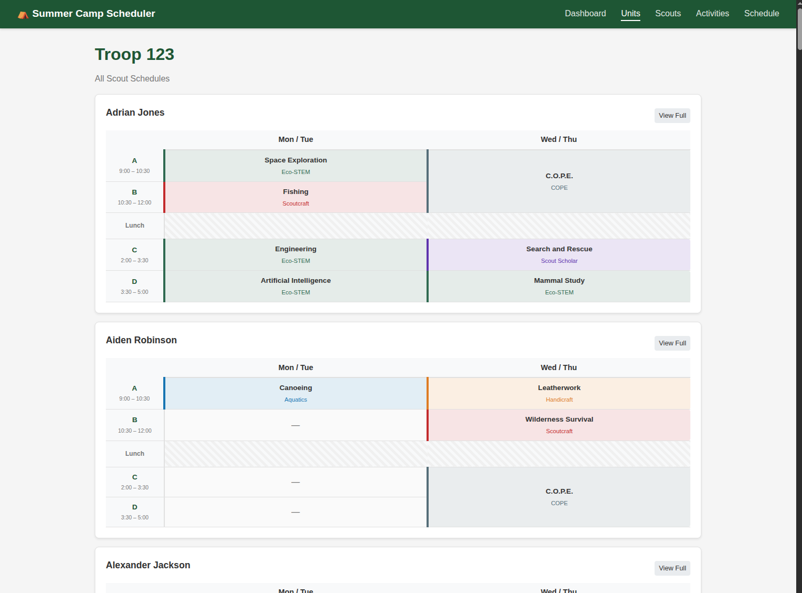
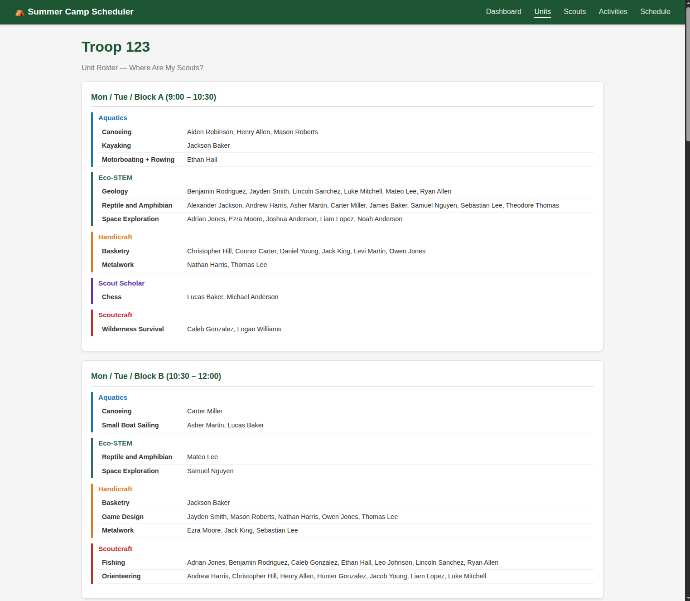

# User Guide — Summer Camp Scheduler

This guide walks unit leaders through using the Summer Camp Scheduler to manage merit badge preferences, run the auto-scheduler, and view schedules and reports.

Instead of competing with other unit leaders for activity slots in real time, this application lets your scouts submit ranked preferences and then automatically builds an optimized schedule for everyone — respecting capacity limits, avoiding time conflicts, and keeping scouts from the same unit together.

---

## Table of Contents

1. [Getting Started](#getting-started)
2. [Managing Units](#managing-units)
3. [Managing Scouts](#managing-scouts)
4. [Setting Preferences](#setting-preferences)
5. [Fill Schedule Option](#fill-schedule-option)
6. [Viewing Activities](#viewing-activities)
7. [Running the Auto-Scheduler](#running-the-auto-scheduler)
8. [Working with the Schedule](#working-with-the-schedule)
9. [Scout Schedule View](#scout-schedule-view)
10. [Unit Schedules Overview](#unit-schedules-overview)
11. [Unit Roster Report](#unit-roster-report)
12. [Tips and Best Practices](#tips-and-best-practices)

---

## Getting Started

Open your web browser and navigate to the application URL (typically `http://localhost:8080`). You'll see the **Dashboard** with a summary of units, scouts, activities, and assignments.

The navigation bar at the top provides access to all sections:

| Tab | Purpose |
|-----|---------|
| **Dashboard** | Overview stats and quick start guide |
| **Units** | Create and manage Scout units (troops, packs) |
| **Scouts** | Add scouts, set preferences, view individual schedules |
| **Activities** | Browse available merit badges and program area sessions |
| **Schedule** | Run the auto-scheduler, view/edit all assignments |

---

## Managing Units

Navigate to **Units** to create your Scout unit.

1. Enter your unit name (e.g., "Troop 123") in the text field
2. Click **Add Unit**

Each unit in the list has three action buttons:

- **Schedules** — View all scout schedules for the unit on one page
- **Roster** — "Where are my Scouts?" report grouped by time block and program area
- **Delete** — Remove the unit and all its scouts (requires confirmation)

---

## Managing Scouts

Navigate to **Scouts** to add scouts to your unit.

1. Enter the scout's name
2. Select the unit from the dropdown
3. Click **Add Scout**

Scouts are displayed grouped by unit. Each scout has action buttons:

- **Schedule** — View the scout's personal weekly schedule grid
- **Preferences** — Set which merit badges the scout wants to take
- **Delete** — Remove the scout (requires confirmation)

---

## Setting Preferences

Click the **Preferences** button next to a scout's name to set their merit badge preferences.

### How Preferences Work

Preferences are **ranked by priority** — the first preference is most important, and the scheduler tries to honor higher-ranked choices first.

1. Select an activity from each dropdown (Preference 1 is highest priority)
2. Add more preferences using additional slots — scouts can have 3–8 preferences
3. Leave a dropdown empty to skip that slot
4. Click **Save Preferences**

### Key Points

- **More preferences = better results.** If the scheduler can't place a top choice due to capacity or time conflicts, it moves to the next preference.
- Preferences are by **activity name**, not by specific time slot. The scheduler automatically picks the best available session.
- The scheduler considers the **buddy system** — it tries to place unit-mates together at the same program area and time block.

---

## Fill Schedule Option

At the bottom of the Preferences page, you'll see a **Fill Schedule** checkbox.

When enabled:

- After the scheduler assigns the scout's preferred activities, it fills **remaining empty time blocks** with random available activities
- Only activities **without prerequisites** are used for fill slots
- The **buddy system** still applies — it prefers activities where unit-mates are already assigned
- Each activity is assigned only once (no duplicates)
- Only single-block activities (A, B, C, D) are used for fill slots to avoid over-committing

This is ideal for scouts who want a full schedule but don't have strong preferences for every time block.

---

## Viewing Activities

Navigate to **Activities** to browse the full catalog of available merit badges and program area sessions.

Each activity listing shows:

| Column | Description |
|--------|-------------|
| **Name** | Merit badge or activity name |
| **Program Area** | Where the activity takes place (Aquatics, Eco-STEM, etc.) |
| **Block** | Time block (A, B, AB, C, D, CD, ABCD) |
| **Half-Week** | When it runs: Mon/Tue ("first"), Wed/Thu ("second"), or all week ("full") |
| **Capacity** | Maximum number of scouts |
| **Enrolled** | Currently assigned count |
| **Prerequisites** | Whether prior completion is required |

### Time Block Reference

| Block | Time | Duration |
|-------|------|----------|
| A | 9:00 – 10:30 | 1.5 hours |
| B | 10:30 – 12:00 | 1.5 hours |
| AB | 9:00 – 12:00 | 3 hours (full morning) |
| C | 2:00 – 3:30 | 1.5 hours |
| D | 3:30 – 5:00 | 1.5 hours |
| CD | 2:00 – 5:00 | 3 hours (full afternoon) |
| ABCD | 9:00 – 5:00 | All day |

### Half-Week Reference

| Value | Days |
|-------|------|
| first | Monday & Tuesday |
| second | Wednesday & Thursday |
| full | Monday through Thursday |

---

## Running the Auto-Scheduler

Navigate to **Schedule** and click **Run Auto-Scheduler**.

### What the Scheduler Does

1. **Sorts scouts** by number of preferences (most constrained first) to maximize successful placements
2. **Assigns preferred activities** in priority order, checking for time conflicts and capacity limits
3. **Applies buddy scoring** — when multiple sessions of an activity are available, it picks the one where unit-mates are already assigned to the same program area and time block
4. **Fills remaining slots** for scouts with "Fill Schedule" enabled, using random non-prerequisite activities with buddy preference

### After Scheduling

The schedule table shows all assignments with:

- Scout name, activity, program area, time block, and half-week
- Lock status (locked assignments survive "Clear Unlocked")
- Action buttons to lock/unlock or remove individual assignments

You can **filter by unit** using the dropdown at the top of the schedule page.

---

## Working with the Schedule

### Locking Assignments

Click **Lock** next to an assignment to protect it. Locked assignments:

- Won't be removed when you click "Clear Unlocked"
- Allow you to re-run the scheduler to fill remaining gaps around locked choices

### Manual Assignment

Use the **Manual Assignment** form at the bottom of the schedule page to hand-pick a specific scout + activity combination.

### Re-running the Scheduler

You can iterate on the schedule:

1. Lock any assignments you want to keep
2. Click **Clear Unlocked** to remove the rest
3. Click **Run Auto-Scheduler** again — it will fill around the locked assignments

### Clearing Everything

Click **Clear Unlocked** to remove all non-locked assignments. To start completely fresh, unlock everything first.

---

## Scout Schedule View

From the **Scouts** page, click the **Schedule** button next to any scout to see their personal weekly grid.

The grid displays:

- **Rows**: Time blocks A through D (with times) and a lunch separator
- **Columns**: Mon/Tue and Wed/Thu
- **Cells**: Color-coded by program area, showing the activity name and area
- **Empty slots**: Marked with a dash

This view matches the layout of the official camp schedule PDF.

---

## Unit Schedules Overview

From the **Units** page, click **Schedules** to see every scout's weekly grid on one page.

Each scout gets their own card with a compact schedule grid and a **View Full** link to jump to their individual detail view.

This is useful for printing or reviewing the full unit's schedule at a glance.

---

## Unit Roster Report

From the **Units** page, click **Roster** to see the "Where Are My Scouts?" report.

The report is organized by:

1. **Day / Time Block** — e.g., "Mon / Tue / Block A (9:00 – 10:30)"
2. **Program Area** — Color-coded (e.g., Aquatics, Eco-STEM)
3. **Activity** — Activity name with a list of scouts assigned

This report answers the key unit leader question: **"Where is each of my scouts right now?"**

---

## Tips and Best Practices

### For Best Scheduling Results

- **Enter at least 4–6 preferences per scout.** More choices give the scheduler flexibility when top picks are full.
- **Enter preferences before running the scheduler.** The scheduler processes all scouts in one pass.
- **Use "Fill Schedule"** for younger scouts or those who want a full camp experience but don't have specific preferences for every block.
- **Lock preferred assignments first**, then re-run to fill gaps — this gives you control over critical placements.

### For Unit Leaders

- Use the **Roster Report** to quickly verify all scouts are accounted for during each time block.
- Use the **Unit Schedules** page for a printable overview of all your scouts' weeks.
- Check the **Activities** page to see current enrollment counts and remaining capacity.

### Buddy System

The scheduler automatically tries to place scouts from the same unit together:

- When choosing between multiple sessions of the same activity, it picks the session where unit-mates are already attending the same program area and time block.
- This applies both to preference assignments and fill-schedule slots.
- The buddy system is a **soft preference**, not a hard constraint — it will still place scouts in the best available session even if no buddies are present.
